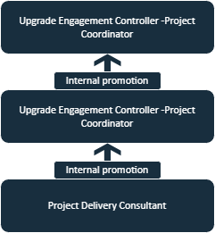

## Hi there 👋

# Table of Contents
- [Introduction](#introduction)
- [Experience](#Experience)
- [Geography](#Geography)
- [Projects](#Projects)
- [Extra-Curriculars](#Extra-Curriculars)
- [Contact](#Contact)

# Introduction

# Experience

  
  
  

The Oracle Journey has been an interesting series of events in my career. Oracle had a healthcare IT division earlier known as Cerner Healthcare which is now acquired. Within the Division, I was part of the Upgrade Center which mainly deals with EMR/EHR software upgrades for hospitals worldwide.
  I had started out with a Project Delivery Consultant – Consultant acting as a solution expert connecting with clients and gaining their requirements for the project and providing insights for a specific solution. Soon after my experience with many clients, I was promoted as a Project Coordinator in the US team – Coordinating activities and perform consulting operations in the organization with clients.

  

The above flowchart represents the hierarchy of the promotions awarded to me during my tenure with Oracle. After receiving multiple positive feedbacks from clients, I was quickly promoted as a Project Manager - Overseeing multiple project upgrades for clients globally and ensuring the successful Go-lives of these projects along with post project issues and tickets.

Prior joining Oracle, I was an associate Software Engineer at Accenture with a specialty of Dev/Ops as my field.
The Major client was Comcast and our team was managing the events and tickets for their servers on multiple platforms. This was my first job after graduating from my Bachelor of Engineering degree, hence work culture and diversity along with inclusion was well taught and trained here.

VI Solutions is an automation Company and a pioneer in providing Systems, Solutions and Products for a wide range of industries and applications.
My internship experience here was splendid and lots of learning capabilities through Robotics, electronics and using the National Instruments Labview software had given me plenty of exposure through the technicalities of automation.

# Geography

I am originally from India, however I have stayed in Dubai and in the United States of America during my childhood as my father used to work in these locations. My family decided to move back to India for my education and I’m back in the US for my Masters degree.

# Projects

My list of projects vary across educational, corporational and eventful instances.

1.First Lego League - Body Forward (2010)
This was the first team related project I had which had a motive, learning experience and a reward as well as exposure to the robotic and corporate environment. This program was sponsored by SAP Labs and was tied up by First Lego League(FLL) who host many of these competitions every year.
This project was very advanced in a way where we program a robot to perform certain tasks in a specific area and within a time limit. Each task has a number of points and they tally up to a particular team once the timer reaches zero.

2.Bachelor Of Engineering Project - Wireless Power Transfer (2019)
This project was to perform a wireless transfer power from one source to another electromagnetically using a multi-wound copper coil. The main goal was to make better efficiency compared to the wireless transfer happening at the time and since this was 2010, wireless transfer was not that well achieved , however we had made a much efficient project and that was applauded for in the whole department.

3.Oracle Upgrade Projects (2020-2023)
In Oracle, plenty of clients have come for their upgrades, many of them are from different geographical locations and with different requirements. Each project can vary anywhere from $500,000 to $2M in revenue. Clients mainly from Australia, United States, Singapore, Middle East, United Kingdom and Japan.

# Extra-curriculars

1.Music Creation
Apart from the professional experience, music is a very enjoyable hobby of mine. I love creating musical beats and tracks either new ones or recreate older hit tracks. I do have a Youtube Channel named “ Untuned Note” and so far I have done 40+ (and counting) short original songs and plan to integrate video visualizations to further back the meaning behind these songs.

https://www.youtube.com/@untunednote/videos

2.Strategy/Olympic Gaming 

I also enjoy gaming and playing e-sports on a competitive level. Currently I play Rocket League and Dota 2 competiviely out of which I’m currently in the top 1% worldwide in Rocket League. Rocket League has also come in the potential list of Olympic video games.

# Contact

<!--
**GoswamiAbhinav/GoswamiAbhinav** is a ✨ _special_ ✨ repository because its `README.md` (this file) appears on your GitHub profile.

Here are some ideas to get you started:

- 🔭 I’m currently working on ...
- 🌱 I’m currently learning ...
- 👯 I’m looking to collaborate on ...
- 🤔 I’m looking for help with ...
- 💬 Ask me about ...
- 📫 How to reach me: ...
- 😄 Pronouns: ...
- ⚡ Fun fact: ...
-->
