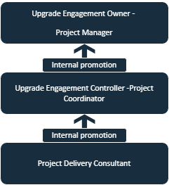

## Hi there 👋

# Table of Contents
- [Introduction](#introduction)
- [Experience](#Experience)
- [Geography](#Geography)
- [Projects](#Projects)
- [Extra-Curriculars](#Extra-Curriculars)
- [Contact](#Contact)

# Introduction

# Experience

The Oracle Journey has been an interesting series of events in my career. Oracle had a healthcare IT division earlier known as Cerner Healthcare which is now acquired. Within the Division, I was part of the Upgrade Center which mainly deals with EMR/EHR software upgrades for hospitals worldwide.
  I had started out with a Project Delivery Consultant – Consultant acting as a solution expert connecting with clients and gaining their requirements for the project and providing insights for a specific solution. Soon after my experience with many clients, I was promoted as a Project Coordinator in the US team – Coordinating activities and perform consulting operations in the organization with clients.

The above flowchart represents the hierarchy of the promotions awarded to me during my tenure with Oracle. After receiving multiple positive feedbacks from clients, I was quickly promoted as a Project Manager - Overseeing multiple project upgrades for clients globally and ensuring the successful Go-lives of these projects along with post project issues and tickets.

Prior joining Oracle, I was an associate Software Engineer at Accenture with a specialty of Dev/Ops as my field.
The Major client was Comcast and our team was managing the events and tickets for their servers on multiple platforms. This was my first job after graduating from my Bachelor of Engineering degree, hence work culture and diversity along with inclusion was well taught and trained here.

VI Solutions is an automation Company and a pioneer in providing Systems, Solutions and Products for a wide range of industries and applications.
My internship experience here was splendid and lots of learning capabilities through Robotics, electronics and using the National Instruments Labview software had given me plenty of exposure through the technicalities of automation.

# Geography

# Projects

# Extra-curriculars

# Contact

<!--
**GoswamiAbhinav/GoswamiAbhinav** is a ✨ _special_ ✨ repository because its `README.md` (this file) appears on your GitHub profile.

Here are some ideas to get you started:

- 🔭 I’m currently working on ...
- 🌱 I’m currently learning ...
- 👯 I’m looking to collaborate on ...
- 🤔 I’m looking for help with ...
- 💬 Ask me about ...
- 📫 How to reach me: ...
- 😄 Pronouns: ...
- ⚡ Fun fact: ...
-->
